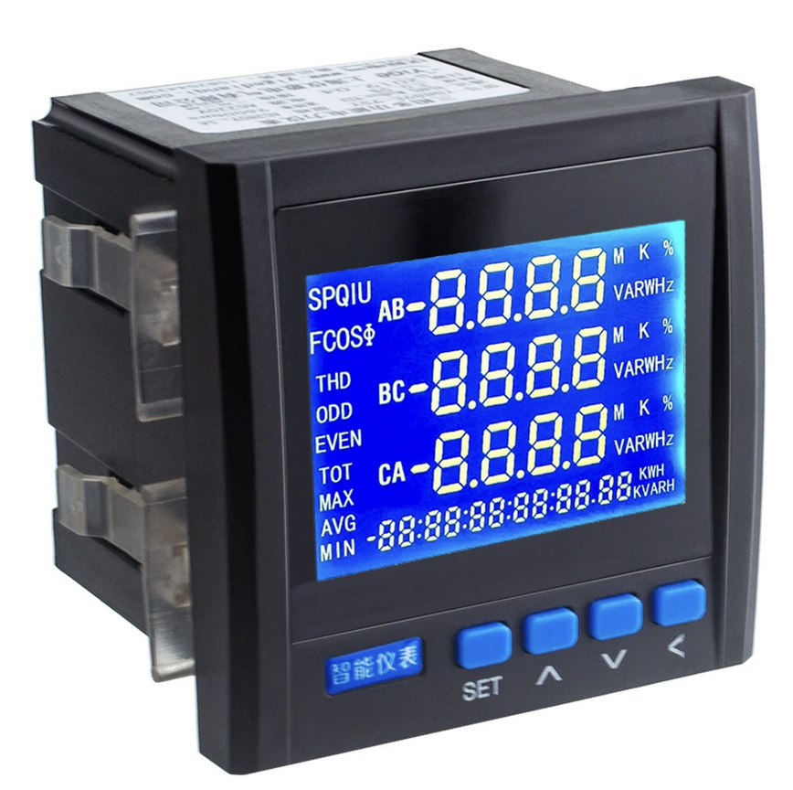

# ⚡ ModBus ESP32 reader for a cheap chinese power meter

This repo details how to use a [Saola-1 ESP32S2 board](https://docs.espressif.com/projects/esp-idf/en/latest/esp32s2/hw-reference/esp32s2/user-guide-saola-1-v1.2.html) coupled with [a RS485 transceiver from
LinkSprite][linksprite_rs485_shield] and connect it to Espressif's IoT cloud platform: [RainMaker][rainmaker].

Also, there's support for [PVoutput.org][pvoutput] graphs since my meter
is coupled to three 500W solar panels (one per phase) equipped with APC
microinverters.



There are several branches, all of them with custom setups that work
with PlatformIO IDE with varying degrees of success:

## 🎋 Branches

* master: FreeModbus from ESP-IDF framework with PVoutput.org and RainMaker
    support.
* emodbus: [eModbus][emodbus] with Arduino, first time I got the Modbus holding registers listed thanks to [this eModbus discussion thread][emodbus_hardware_discussion].
* arduino-rainmaker: Same as emodbus, but trying to mix in RainMaker, ultimately switching to ESP-IDF (on `master`) after realising that Arduino support for RainMaker is in the works at the time of writing this.

## 🤖 Hardware setup

The hardware setup is very similar to [this eModbus hardware example thread][emodbus_hardware_example] with a couple of notable differences:

1) The use of a [ttl level converter][ttl_level_converter] between the MAX458CPE RS485 (5V level) transceiver and the Espressif board (which is 3.3V level).
2) RE/DE circuitry is handled by the LinkSprite shield instead of [via software with `REDEPIN`][redepin]. This is because [the shield has a transistor-based automatic switching between transmitting and receiving][auto_rede].

Here's a picture at some of the hardware specs from the power meter:


## 🖥️ Code structure

Don't forget to clone it like this, otherwise the RainMaker submodules
will not be pulled and the code will not compile:

```
git clone --recursive https://github.com/brainstorm/yigedianqi-modbus/
```

[When and if Espressif merges my RainMaker power metering PR, I'll
repoint those submodules away from my
fork][espressif_rainmaker_powermeter_pr].

The protocol used on top of RS485 is Modbus-RTU with 8N1 parity and with this code is acting as a `master` and the power meter as `master`.

* `app_modbus.c`: ModBus RTU code
* `app_rmaker.c`: RainMaker setup for parameters and updates.
* `app_time.c`: PVoutput.org time and date formatting for watts submission.
* `app_rgbled.c`: Nothing to see here, move along XD
* `platformio.ini`: Embeeded certs for RainMaker and other flashing/building goodies.

## ✋ How can you contribute?

1. Review your own power meter's manual and find the register(s) listing.
3. Come up with a way to share this codebase with other third party (custom) ModBus power meter definitions and submit a pullrequest with [CID characteristics like mine here](https://github.com/brainstorm/yigedianqi-modbus/blob/f6a4d453bac206fb2ed3160085f9e9adee2a0960/src/app_modbus.c#L120-L161).
4. Code review, audit and clean my messy code, specially the use of global variables and **substitute it with proper FreeRTOS queues, semaphores and mutexes instead**.

## 🌀 Random notes

There are a few vague, vestigial references online about this power meter:

1. There's a [youtube][youtube_usage] video showing the default setup password and some basic usage/configuration.
2. A possible company spinoff, [from yiGedianqi to yiHedianqi][possible_company_spinoff]?
3. Several [Amazon customers rating this meter][amazon_power_meter_ratings] and pointing out that it only comes with a chinese manual (true story).
4. [A similar project, including Grafana, RPi and other power meters supported.][guillermo_electrico]


[youtube_usage]: https://www.youtube.com/watch?v=22_Wp99j8_U
[possible_company_spinoff]: http://www.yihedianqi.com/
[amazon_power_meter_ratings]: https://www.amazon.com/3-Phase-Electric-Voltage-Multifunction-Frequency/dp/B078NRNM37
[emodbus_hardware_discussion]: https://github.com/eModbus/eModbus/discussions/166
[rainmaker]: https://rainmaker.espressif.com
[emodbus]: https://emodbus.github.io
[emodbus_hardware_example]: https://github.com/eModbus/eModbus/discussions/112#discussion-3650333
[ttl_level_converter]: https://hackaday.com/2016/12/05/taking-it-to-another-level-making-3-3v-and-5v-logic-communicate-with-level-shifters/
[redepin]: https://github.com/eModbus/eModbus/blob/2c740aa0960328fb0851ab0ff771236b14ed7838/examples/RTU04example/main.cpp#L21
[auto_rede]: https://docs.espressif.com/projects/esp-idf/en/latest/esp32/api-reference/peripherals/uart.html#circuit-c-auto-switching-transmitter-receiver
[guillermo_electrico]: https://github.com/GuillermoElectrico/energy-meter-logger
[pvoutput]: https://pvoutput.org/
[espressif_rainmaker_powermeter_pr]: https://github.com/espressif/esp-rainmaker/pull/121
[linksprite_rs485_shield]: https://www.electan.com/rs485-shield-amp-4078-en.html
