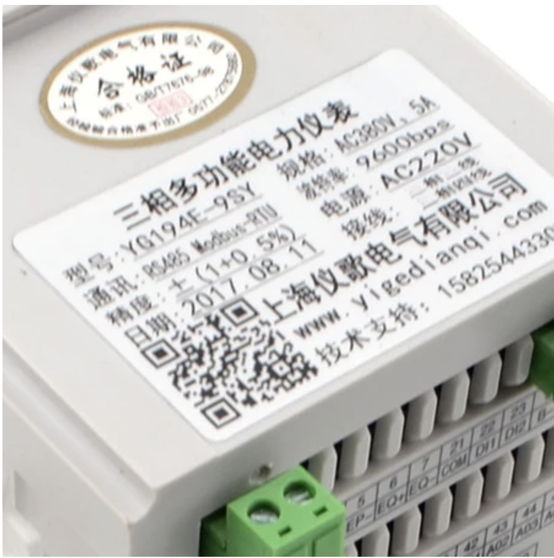

# ModBus ESP32 reader for a cheap Aliexpress power meter

This repo details how to use a [Saola-1 ESP32S2 board](https://docs.espressif.com/projects/esp-idf/en/latest/esp32s2/hw-reference/esp32s2/user-guide-saola-1-v1.2.html) coupled with [a RS485 transceiver from
LinkSprite](http://shieldlist.org/linksprite/rs485) and connect it to Espressif's IoT cloud platform: [RainMaker][rainmaker].

There are several branches, all of them with custom setups that work with PlatformIO with varying degrees of success.

## Hardware setup

TODO:

* Wiring diagram.
* Struggles with termination resistors, pull ups/downs, logic level conversion due to the use of MAX485 (5V) instead of MAX481 (3.3V compatible).
* eModbus thread about the attempts, thanks to the main dev for their patience.
* REDEPIN not needed due to the LinkSprite passives arrangement (To be determined how it actually works, perhaps very close/related to espressif docs about full duplex shields.)

## Code structure

TODO:

* Point out app_modbus.c and app_rgbled.c.
* PlatformIO certificate and CMakefile gotchas.
* Sdkconfig gotchas (perhaps as an issue?): filepath of sdkconfig-saola-1 is not reliably saved.

## How can you contribute?

1. Review your power meter's manual.
2. Find the register(s) listing.
3. Submit a pullrequest with CID characteristics.

## Notes

There are a few vague, vestigial references online about this power meter:

1. There's a [youtube][youtube_usage] video showing the default setup password and some basic usage/configuration.
2. A possible company spinoff, [from yigedianqi to yiHedianqi][possible_company_spinoff]?
3. Several [Amazon customers rating this meter][amazon_power_meter_ratings] and pointing out that it only comes with a chinese manual (true).

[youtube_usage]: https://www.youtube.com/watch?v=22_Wp99j8_U
[possible_company_spinoff]: http://www.yihedianqi.com/
[amazon_power_meter_ratings]: https://www.amazon.com/3-Phase-Electric-Voltage-Multifunction-Frequency/dp/B078NRNM37
[emodbus_hardware_discussion]: https://github.com/eModbus/eModbus/discussions/166
[rainmaker]: https://rainmaker.espressif.com